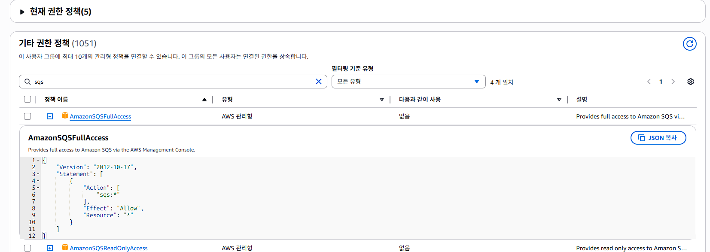
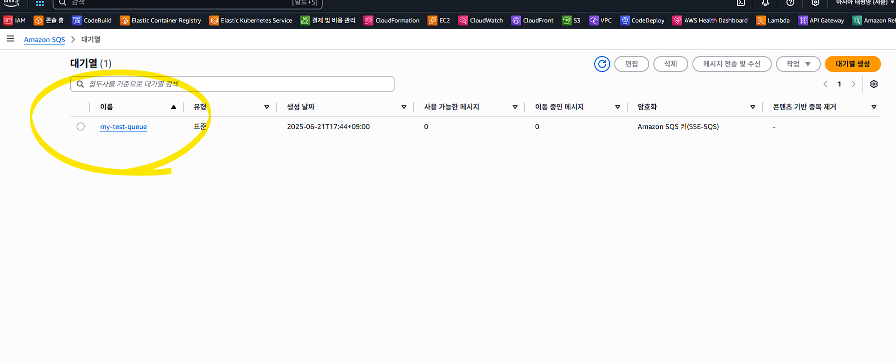
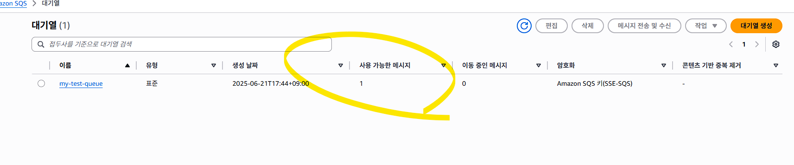
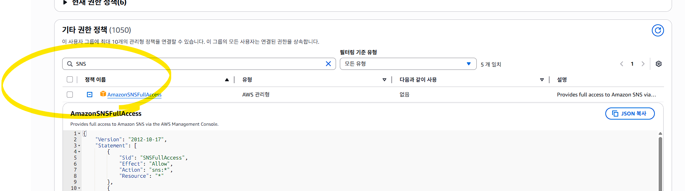
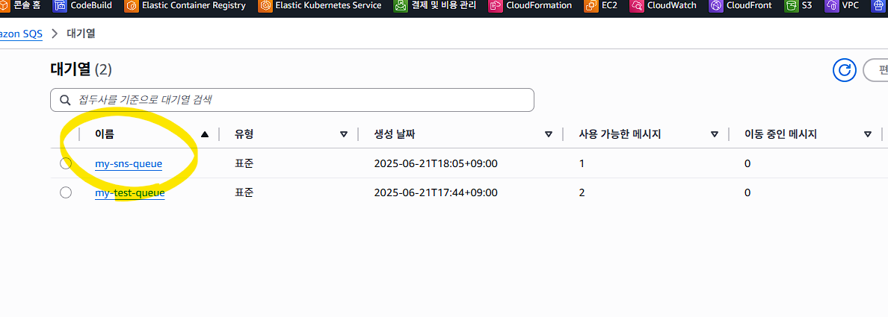

## 0630 수업

# AWS_SQS_ElasticCache

1. AWS SQS (Simple Queue Service)
✅ 개념 요약
SQS는 메시지를 큐(queue)에 넣고, 꺼내는 방식으로 시스템 간 비동기 통신을 가능하게 해주는 서비스입니다.

✅ 주요 특징
비동기 처리: 생산자(Producer)와 소비자(Consumer)의 처리 속도가 달라도 문제없이 데이터 전달 가능

완전관리형: 서버 구축이나 유지보수 없이 사용

내구성: 메시지는 3중 복제 저장으로 손실 위험 거의 없음

유형 2가지:

Standard Queue: 무제한 처리량, 최소 1회 전달 보장, 순서 보장 ❌

FIFO Queue: 정확히 1회 처리, 메시지 순서 보장, 처리량 제한

✅ 활용 예시
사용자 주문을 큐에 넣고, 백엔드에서 순차적으로 처리

이미지 업로드 후, 썸네일 생성 처리를 비동기로 수행

마이크로서비스 간 데이터 전달

## S3 완전 개방
aws s3api put-bucket-policy `
  --bucket edumgt-java-education `
  --policy file://s3-policy.json

## 큐 만들기
aws sqs create-queue --queue-name my-test-queue

## Error
An error occurred (AccessDenied) when calling the CreateQueue operation: User: arn:aws:iam::086015456585:user/DevUser0002 is not authorized to perform: sqs:createqueue on resource: arn:aws:sqs:ap-northeast-2:086015456585:my-test-queue because no identity-based policy allows the sqs:createqueue action

## 권한 부여

## 결과
{
    "QueueUrl": "https://sqs.ap-northeast-2.amazonaws.com/086015456585/my-test-queue"
}

## 콘솔 확인

## 메세지 보내기
aws sqs send-message `
  --queue-url https://sqs.ap-northeast-2.amazonaws.com/086015456585/my-test-queue `
  --message-body '안녕하세요! 이건 테스트 메시지입니다.'

## 결과
{
    "MD5OfMessageBody": "11b4b81379e4a214e981839eae5b94bd",
    "MessageId": "b48bb9d4-4a97-4394-915a-2c1cbfdc4f4c"
}

## 위에서 MD5OfMessageBody 필드는 메시지 본문의 복호화용이 아니라, 메시지 무결성 확인용입니다.
## 즉, "해당 메시지가 손상되지 않고 제대로 전송됐는지" 검증하기 위해 사용됩니다.

## 예제의 python 모듈로 body 문장에 입력하는 내용의 일치 여부에 따라 
PS C:\edumgt-java-education\AWS_SQS_ElasticCache> python check.py
❌ 메시지가 손상되었거나 변조되었습니다.
PS C:\edumgt-java-education\AWS_SQS_ElasticCache> python check.py
✅ 메시지 무결성 확인됨!

check.py 의 body = '안녕하세요! 이건 테스트 메시지입니다.' 부분 수정하면서 체크 가능
와 같습니다. 

## 메시지 수신 
aws sqs receive-message `
  --queue-url https://sqs.ap-northeast-2.amazonaws.com/086015456585/my-test-queue

## 결과
{
    "Messages": [
        {
            "MessageId": "b48bb9d4-4a97-4394-915a-2c1cbfdc4f4c",
            "ReceiptHandle": "AQEB8Zlctqav7+EZMhX0nHjbv0NfyjkRKCfnKcqv3lvE8kAkUVommwa4DpO1sFzpLkvTAl+xCM/BhlHTr3MykZKFdXLeMqRDNpMvrE5BsXmAlnketPkp39VvIafRlr/7VU+wbrJvQLMxYIjksf4uyfPl1XRACmPXLJ/OTwiGHo+M6CetVWhsmGtrE/UM5WJMCiT1Lr6GN2lEA1Z8DESy25+2+V6mVUhV+4y6a1YmWXzbPLErZdlshOYgOeMPnzyHAZHhMCNAnFJF71OLqHfdON8/sTqb6EC/JVIzjnID+bzQRvUVUo56LctKTruiD6cREpW8y56dhdLhm1RsGH3O9g2HzeIXEGPSirQxRuezoeI+kbIb95/GL2iH8fuf9lVR5LmZP+ckevdsPpz6heAzduxnWQ==",
            "MD5OfBody": "11b4b81379e4a214e981839eae5b94bd",
            "Body": "안녕하세요! 이건 테스트 메시지입니다."
        }
    ]
}

## python 으로 테스트 하기 위해
pip install boto3

## 테스트 실행
python sqs.py

## 결과
✅ 메시지 전송 완료
MessageId: b86cc94e-9858-4c87-8629-b9b18e5b37fa
MD5OfMessageBody: 40ca02b8b3f81347d8ceb1b0769de9e3

📩 메시지 수신
Body: {"message": "python\uc73c\ub85c \ud14c\uc2a4\ud2b8 \ud569\ub2c8\ub2e4."}
MD5 검증: ✅ 일치
🗑️ 메시지 삭제 완료

## sqs.py 소스의 수신 부분을 주석을 처리하여 받지 않으면
    # 2. 메시지 받기
    # receive_message()

## 콘솔에서 대기 확인

## SNS 연동
**Amazon SNS (Simple Notification Service)**는 **이벤트를 여러 구독자(Subscriber)에게 푸시(Push)**하는 서비스입니다.
SQS, Lambda, Email, HTTP 엔드포인트 등이 구독자가 될 수 있고,
SQS와 연동하면 → SNS → SQS로 자동 전달되는 구조를 만들 수 있습니다.

## SNS 생성
aws sns create-topic --name my-sns-topic

## Error
An error occurred (AuthorizationError) when calling the CreateTopic operation: User: arn:aws:iam::086015456585:user/DevUser0002 is not authorized to perform: SNS:CreateTopic on resource: arn:aws:sns:ap-northeast-2:086015456585:my-sns-topic because no identity-based policy allows the SNS:CreateTopic action

## 권한 부여

## ARN 생성
{
    "TopicArn": "arn:aws:sns:ap-northeast-2:086015456585:my-sns-topic"
}

## SNS 큐 신규 생성
aws sqs create-queue --queue-name my-sns-queue
{
    "QueueUrl": "https://sqs.ap-northeast-2.amazonaws.com/086015456585/my-sns-queue"
}

## 구독자 생성
aws sns subscribe `
  --topic-arn arn:aws:sns:ap-northeast-2:086015456585:my-sns-topic `
  --protocol sqs `
  --notification-endpoint arn:aws:sqs:ap-northeast-2:086015456585:my-sns-queue
{
    "SubscriptionArn": "arn:aws:sns:ap-northeast-2:086015456585:my-sns-topic:b9706c53-760f-4b8e-bf9d-cfc107a0f98c"
}

## 메시지 수신 허용 - json 의 \" 문자열에 특히 주의 필요
1. sqs-policy.json 생성
2. aws sqs set-queue-attributes --cli-input-json file://sqs-policy.json
3. 적용 확인
aws sqs get-queue-attributes `
  --queue-url https://sqs.ap-northeast-2.amazonaws.com/086015456585/my-sns-queue `
  --attribute-names Policy

{
    "Attributes": {
        "Policy": "{\"Version\":\"2012-10-17\",\"Statement\":[{\"Effect\":\"Allow\",\"Principal\":{\"Service\":\"sns.amazonaws.com\"},\"Action\":\"SQS:SendMessage\",\"Resource\":\"arn:aws:sqs:ap-northeast-2:086015456585:my-sns-queue\",\"Condition\":{\"ArnEquals\":{\"aws:SourceArn\":\"arn:aws:sns:ap-northeast-2:086015456585:my-sns-topic\"}}}]}"
    }
}

## 메시지 발행 (SNS에 메시지를 Publish하면 SQS로 전달됨)
aws sns publish `
  --topic-arn arn:aws:sns:ap-northeast-2:086015456585:my-sns-topic `
  --message '안녕하세요! SNS에서 보내는 메시지입니다.'

## 콘솔에서 확인

## sqs.py 의 다음을 수정해서 테스트 반복
QUEUE_URL = 'https://sqs.ap-northeast-2.amazonaws.com/086015456585/my-sns-queue'
