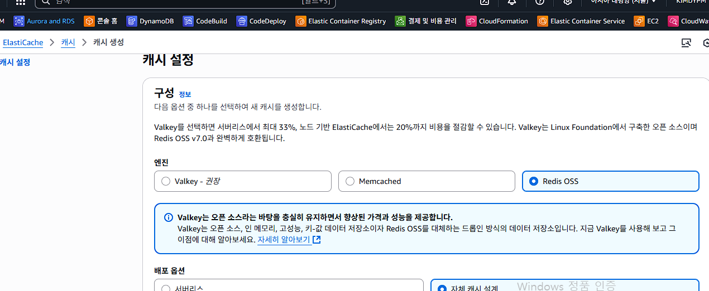
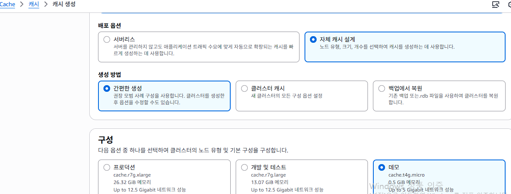
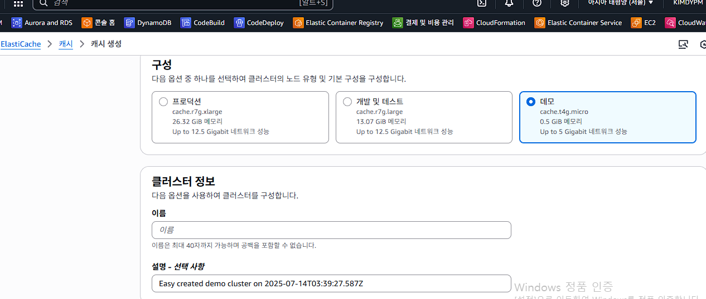

# AWS ElastiCache 학습 정리

## 개요
**ElastiCache**는 AWS에서 제공하는 **인메모리 캐시 서비스**로, **Redis** 또는 **Memcached** 엔진을 사용할 수 있는 **완전관리형 캐시**입니다.

### 주요 특징
- **빠른 데이터 접근**: 메모리에 저장되어 DB보다 훨씬 빠름
- **부하 분산**: 자주 요청되는 데이터 캐싱으로 DB 부담 감소
- **지원 엔진**: Redis (주로 사용), Memcached
- **Auto Scaling & Cluster**: Redis는 샤딩/복제 구성 가능

### 활용 예시
- 로그인 세션/토큰 저장
- 인기 게시물/상품 리스트 캐싱
- API 응답 결과 캐싱
- 실시간 게임 랭킹 저장

---

## 콘솔 설정


---

## Valkey 소개 (Redis 오픈소스 대체)
**Valkey**는 Redis 7.2 코드를 기반으로 탄생한 **완전한 오픈소스 인메모리 키-값 저장소**입니다.

### 등장 배경
2024년 초 Redis Labs가 Redis 라이선스를 오픈소스(LGPL/BSD)에서 **상용 라이선스**로 변경했습니다.
이에 따라 AWS, Google Cloud, Oracle 등 클라우드 기업들이 **오픈소스 정신을 잇는 포크 프로젝트**를 시작했고, 그 결과가 **Valkey**입니다.

### 비교 표
| 항목 | Redis | Valkey |
| --- | --- | --- |
| 라이선스 | Redis Source Available (RSAL 등) | **Apache 2.0** |
| 기반 | Redis 7.2 포크 | Redis 7.2 기반에서 지속 발전 |
| 커뮤니티 | Redis Labs 주도 | Linux Foundation, AWS, GCP 등 주도 |
| 호환성 | Redis 클라이언트 사용 가능 | ✅ Redis 클라이언트 100% 호환 |
| 사용 방식 | Redis처럼 사용 | 동일 (포트 6379, CLI 등 동일) |

---

## 캐시(Cache)란?
캐시는 **자주 사용하는 데이터를 빠르게 꺼내기 위해 미리 저장해두는 공간**입니다.
쉽게 말해 **임시 저장소** 또는 **빠른 복사본**입니다.


---

## 네트워크/서브넷 오류 대응
### 오류 화면


**원인**: 사용 중인 서브넷이 3개 미만

### 해결 절차
1. 사용자 설정으로 변경
2. 서브넷 3개 이상 생성 후 설정


---

## VPC 서브넷 추가


> IP 대역 설정 시 임의 값을 입력 후 하단 화살표로 조정

### 서브넷 3개 확인


---

## ElastiCache 설정 재시도
서브넷을 3개 모두 선택 후 설정합니다.


---

## 캐시 서버 생성
> 생성에 수 분 소요될 수 있습니다.


---

## 엔드포인트 복사


---

## 연결 테스트 (redistest.py)
### 설치
```bash
pip install redis
```

### 오류 예시
```text
TimeoutError: [WinError 10060] 연결된 구성원으로부터 응답이 없어 연결하지 못했거나, 
호스트로부터 응답이 없어 연결이 끊어졌습니다
```

**해결**: 방화벽 포트 개방 필요


> 기존 서브넷 구성 문제로 신규 VPC/서브넷 구성 후 연결 필요할 수 있음

---

## Server 방식 설정




---

## 외부 퍼블릭 접속 관련 주의
**비추천 (테스트용만 가능)**

- EC2에 직접 Redis 설치
- 보안그룹에서 `0.0.0.0/0`에 TCP 6379 개방 (**매우 위험**)
- 퍼블릭 IP로 접근 가능

```bash
sudo yum install redis
sudo systemctl start redis
redis-cli -h <your-ec2-public-ip> -p 6379
```

> 🔥 **운영 환경에서는 절대 사용 금지**: 공격에 매우 취약합니다.
