2. AWS ElastiCache
✅ 개념 요약
ElastiCache는 AWS에서 제공하는 인메모리 캐시 서비스로, Redis 또는 Memcached 엔진을 사용할 수 있는 완전관리형 캐시 서버입니다.

✅ 주요 특징
빠른 데이터 접근 속도: 메모리에 저장되어 DB보다 수십~수백 배 빠름

부하 분산: 자주 요청되는 데이터를 캐싱하여 RDS/DB의 부담 감소

지원 엔진: Redis (주로 사용), Memcached

Auto Scaling & Cluster 지원: Redis의 경우 샤딩 및 복제 가능

✅ 활용 예시
로그인 세션 저장 (ex. 로그인 토큰)

인기 게시물, 상품 리스트 캐싱

API 응답 결과 캐싱

실시간 게임 순위 저장

## 콘솔로 설정
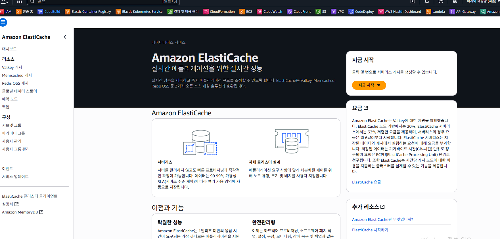

## 기존 redis 가 상용화 되면서 valkey 등장
valkey는 Redis의 오픈소스 대체 프로젝트입니다.
이전까지 사용되던 Redis OSS의 뒤를 잇는 진짜 오픈소스 Redis라고 보시면 됩니다.

✅ Valkey란?
📌 한 줄 정의:
Valkey는 Redis 7.2 코드를 기반으로 탄생한, 완전한 오픈소스 인메모리 키-값 저장소입니다.

🔥 왜 Valkey가 나왔나요?
📌 배경 요약:
2024년 초 Redis Labs가 Redis의 라이선스를 오픈소스(LGPL/BSD) → 상용 라이선스로 바꿨습니다.

그 결과, AWS, Google Cloud, Oracle 등 클라우드 기업들이 Redis의 포크(fork)를 만들어 오픈소스 정신을 잇는 새로운 프로젝트를 시작했습니다.

이 프로젝트가 바로 Valkey입니다.

| 항목    | Redis                           | Valkey                          |
| ----- | ------------------------------- | ------------------------------- |
| 라이선스  | Redis Source Available (RSAL 등) | **Apache 2.0 (진짜 오픈소스)**        |
| 기반    | Redis 7.2 포크                    | Redis 7.2 기반에서 지속 발전            |
| 커뮤니티  | Redis Labs 주도                   | Linux Foundation, AWS, GCP 등 주도 |
| 호환성   | Redis 클라이언트 사용 가능               | ✅ Redis 클라이언트 100% 호환           |
| 사용 방식 | Redis처럼 사용                      | 동일 (포트 6379, CLI 등 동일)          |

## redis 의 캐시는
캐시(Cache)란?
자주 사용하는 데이터를 빠르게 꺼내 쓰기 위해 미리 저장해 두는 공간입니다.
쉽게 말하면 “임시 저장소” 또는 “빠른 복사본” 이라고 생각하시면 됩니다.

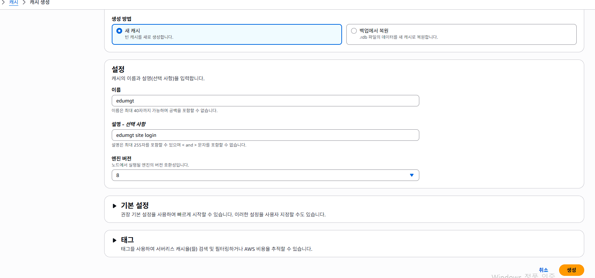

## Error
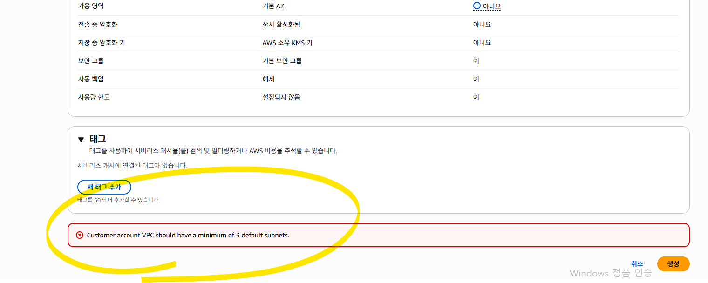
현재 사용 subnet 이 3개 미만으로 오류

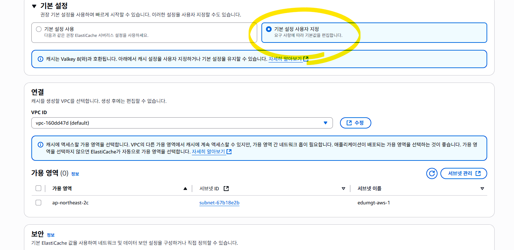
사용자 설정으로 변경 후 서브넷 3개 이상 만들고 설정

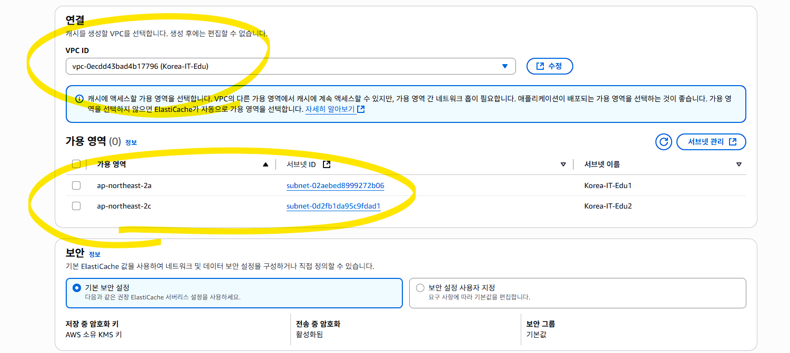 현재 VPC 는 ALB 작업으로 2개 사용 중
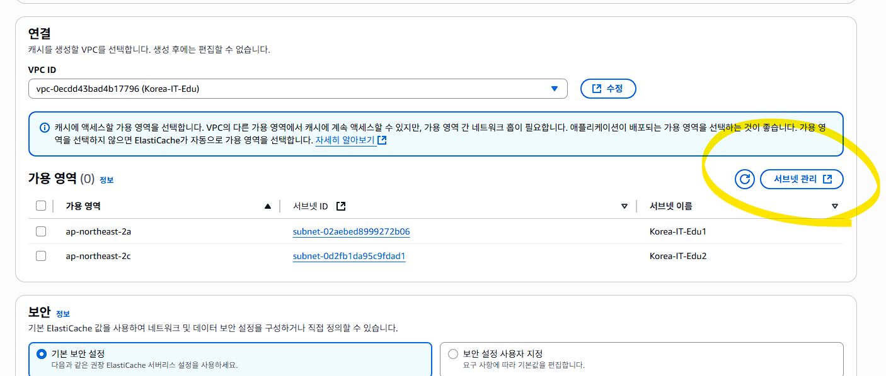 서브넷 관리 클릭

## VPC 의 서브넷 추가
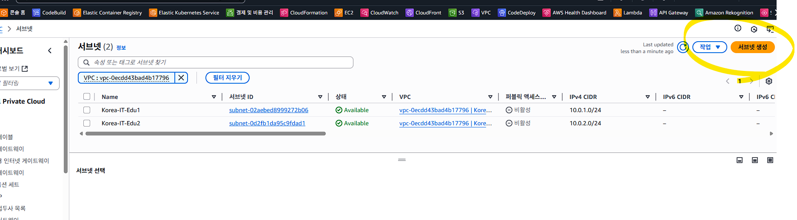
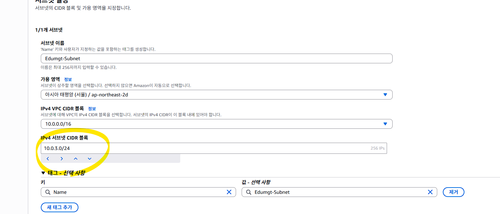
위의 IP 대역 설정할때, 임의 값 입력 후 하단 화살표를 통해 조정

## 서브넷 3개 확인
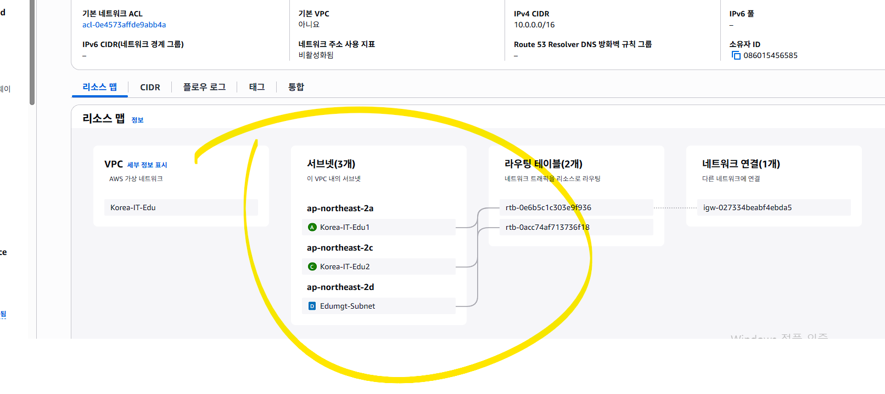

## ElastiCache 화면으로 돌아와 서브넷 리프레시
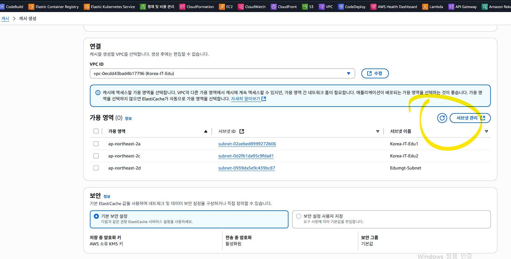
서브넷 3개 모두 선택 하여 설정

## 캐시 서버 설정 중의 시간 몇분 소요
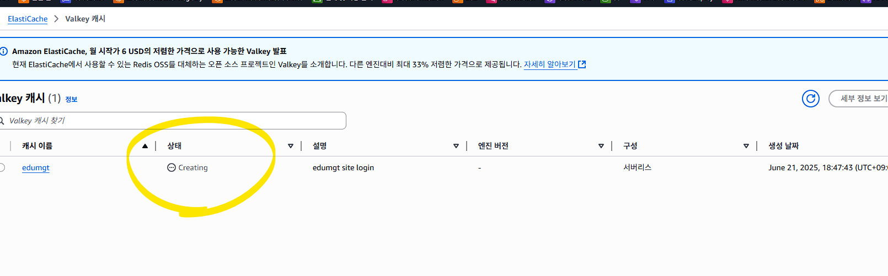
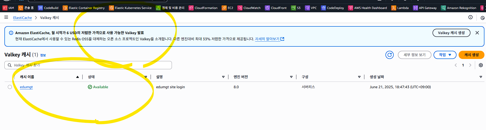

## 엔드포인트를 복사함
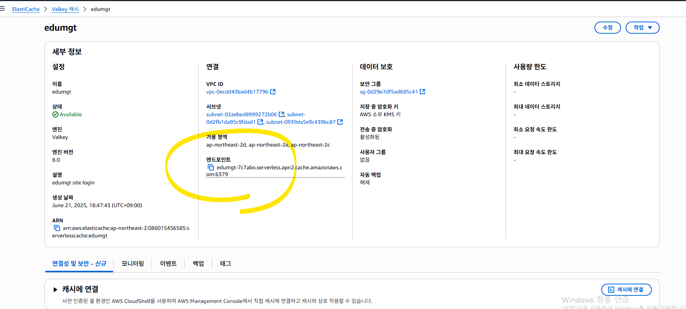

## redistest.py 실행
## pip install redis
## Error
TimeoutError: [WinError 10060] 연결된 구성원으로부터 응답이 없어 연결하지 못했거나, 호스트로부터 응답이 없어 연결이 끊어졌습니다

위의 오류라면 방화벽 포트 개방 필요
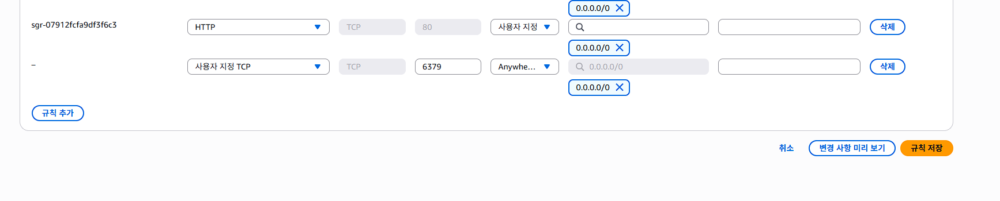

## 기존 서브넷과의 문제로 신규 VPC 및 서브넷 구성 후 연결 필요